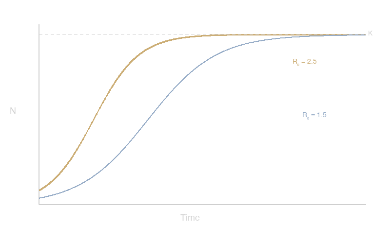

# Prologue {.divider}

## An old observation

Epidemiologists have remarked for more than a century that epidemic
curves are roughly bell-shaped --- rising quickly, peaking, then
declining more slowly.

This asymmetry is not accidental. It encodes the depletion of
susceptibles, the basic reproduction number, and the mixing
structure of the population.

::: {.fragment}
What can the *shape* of a curve tell us, without fitting a model?
:::

## The SIR curve in closed form

The epidemic curve of the SIR model satisfies

$$
I(t) = N - S(t) - R(t)
$$

where $S(t)$ obeys the implicit relation

$$
S = S_0 \exp\!\left( -\frac{R_0}{N} \left( N - S - I \right) \right).
$$

The shape is controlled entirely by $R_0$ and the initial conditions.

### A remarkable compression of information

## Symmetry and skewness {.figure-dark}

{fig-align="center"}

<p class="caption">Saturation curves for two growth rates, illustrating the relationship between $R_0$ and approach to equilibrium.</p>

## Symmetry near the threshold

> Near the epidemic threshold ($R_0$ just above 1), the epidemic
> curve is approximately symmetric about its peak.

As $R_0$ increases, the curve becomes more asymmetric --- rising
steeply as susceptibles are depleted, then declining more slowly
at a rate governed by recovery.

## Dreissenid mussel invasions {.figure}

{fig-align="center"}

<p class="caption">Newly invaded lakes (left) and cumulative invaded lakes (right) for *D. polymorpha* and *D. bugensis* in North America.</p>

# Methodology {.transition}

Quantifying the geometry

## Measuring shape in practice

Three non-parametric descriptors suffice:

| Descriptor             | What it captures                         |
|------------------------|------------------------------------------|
| Peak timing            | Speed of spread                          |
| Skewness               | Susceptible depletion rate               |
| Kurtosis               | Homogeneity of mixing                    |

Together, these form a *shape signature* that can be compared
across outbreaks without assuming a generative model.

## Computing the descriptors

```r
shape_signature <- function(incidence) {
  t_peak <- which.max(incidence)
  mu3    <- moments::skewness(incidence)
  mu4    <- moments::kurtosis(incidence)

  list(
    peak_timing = t_peak,
    skewness    = round(mu3, 3),
    kurtosis    = round(mu4, 3)
  )
}
```

## What shapes encode

Different epidemiological conditions leave signatures in the
curve geometry:

- **High $R_0$, homogeneous mixing** --- sharp peak, pronounced right skew
- **Lower $R_0$, near threshold** --- broader, more symmetric curve
- **Structured contact patterns** --- deviations from the simple SIR shape

::: {.fragment}
The shape carries a fingerprint of population immunity and
contact structure.
:::

## Landscapes of disease {background-image="figures/field.jpg" background-size="cover"}

::: {.frosted}
The spatial structure of host populations imprints itself on
epidemic shape --- a signature as readable as the curve itself.
:::

## Collaborators {.collaborators}

::: {.people}

::: {.person}


Pejman Rohani
:::

::: {.person}


Andrew Park
:::

::: {.person}


Suzanne O'Regan
:::

::: {.person}


Bogdan Epureanu
:::

:::

:::

## {.full-image background-image="figures/photo.png" background-size="cover" background-position="center"}

::: {.full-image-label}
Full image slide
:::

## Acknowledgments {.watermark background-image="figures/watermark.png" background-size="contain" background-position="center" background-opacity="0.12"}

This lecture draws on collaborative work with colleagues at the
Odum School of Ecology and the Center for the Ecology of
Infectious Diseases.

# Coda {.divider}

## Closing thought

The epidemic curve is not merely a summary statistic. It is a
projection of a high-dimensional dynamical system onto a single
axis --- time.

Reading its geometry is an exercise in inverse reasoning: from
shadow back to shape.

::: {.fragment}
*Thank you.*

jdrake@uga.edu
:::
