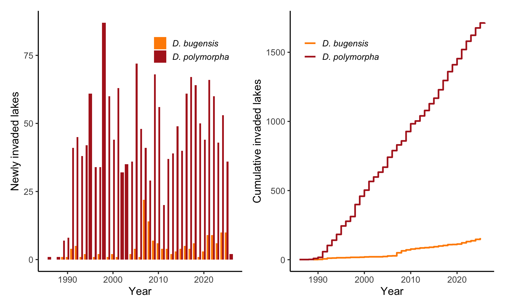
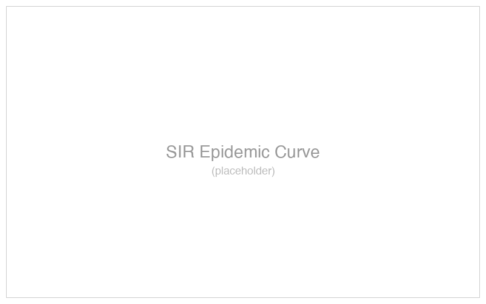

# Welcome {.divider}

## Today's plan

We are going to build up the SIR model from first principles and
connect it to real disease systems.

- What is a compartmental model?
- Where do the equations come from?
- What can we learn from them?

### By the end you will be able to simulate an epidemic in R

## What is a compartment?

A compartment is a group of individuals who share the same
disease status:

- **S** --- Susceptible (can become infected)
- **I** --- Infectious (can transmit)
- **R** --- Recovered (immune)

The key assumption: everyone within a compartment is
interchangeable.

## The flow diagram {.figure-slide}

{fig-align="center"}

<p class="caption">The SIR flow diagram. Arrows represent transitions between compartments at rates $\beta$ and $\gamma$.</p>

## Writing the equations

From the flow diagram we can write three differential equations:

$$
\frac{dS}{dt} = -\beta S I / N
$$

$$
\frac{dI}{dt} = \beta S I / N - \gamma I
$$

$$
\frac{dR}{dt} = \gamma I
$$

### Notice that $dS/dt + dI/dt + dR/dt = 0$ --- the population is closed

## What do the parameters mean?

| Parameter  | Meaning                        | Typical unit    |
|------------|--------------------------------|-----------------|
| $\beta$    | Transmission rate              | per capita/day  |
| $\gamma$   | Recovery rate                  | per capita/day  |
| $R_0$      | $= \beta / \gamma$            | dimensionless   |
| $1/\gamma$ | Mean infectious period         | days            |

### $R_0$ is the average number of secondary cases from one infected individual in a fully susceptible population

## Dreissenid mussel invasions {.figure}

{fig-align="center"}

<p class="caption">Newly invaded lakes (left) and cumulative invaded lakes (right) for *D. polymorpha* and *D. bugensis* in North America.</p>

# Computation {.transition}

From equations to code

## Simulating in R

```r
library(deSolve)

sir <- function(t, y, parms) {
  with(as.list(c(y, parms)), {
    dS <- -beta * S * I / N
    dI <-  beta * S * I / N - gamma * I
    dR <-  gamma * I
    list(c(dS, dI, dR))
  })
}

parms <- c(beta = 0.4, gamma = 0.2, N = 1000)
y0    <- c(S = 999, I = 1, R = 0)
times <- seq(0, 150, by = 0.5)

out <- ode(y = y0, times = times, func = sir, parms = parms)
```

## The epidemic curve {.figure-slide}

{fig-align="center"}

<p class="caption">SIR dynamics with $R_0 = 2$. The epidemic peaks when $S = N / R_0 = 500$.</p>

## An important threshold

> An epidemic can only grow when $R_0 > 1$. This is the
> epidemic threshold.

When $R_0 < 1$, each infected person replaces themselves with
fewer than one new case and the outbreak fades.

This is why vaccination works: reduce the effective $R_0$
below 1.

## Real-world examples

Compartmental models have been applied to:

- **Influenza** --- seasonal forecasting
- **Ebola** --- real-time intervention planning
- **COVID-19** --- vaccination rollout modeling
- **Chytrid fungus** --- amphibian conservation

::: {.fragment}
The SIR framework is the starting point for all of these.
:::

## Fieldwork connections {background-image="figures/field.jpg" background-size="cover"}

::: {.frosted}
The parameters in our equations come from fieldwork --- contact
surveys, mark-recapture studies, and longitudinal sampling in
natural populations.
:::

## Teaching team {.collaborators}

::: {.people}

::: {.person}


Paige Miller
:::

::: {.person}


Tobias Brett
:::

::: {.person}


Éric Marty
:::

:::

## {.full-image background-image="figures/photo.png" background-size="cover" background-position="center"}

::: {.full-image-label}
Full image slide
:::

## Course information {.watermark background-image="figures/watermark.png" background-size="contain" background-position="center" background-opacity="0.10"}

All lecture slides and code are available on the course
eLC page. Problem sets are due Fridays at 5 pm.

## What we covered today

1. Compartments group individuals by disease status
2. Flow diagrams translate directly to differential equations
3. $R_0$ controls whether an epidemic grows or fades
4. Simulation in R is straightforward with `deSolve`

### Next week: adding births, deaths, and waning immunity

# Questions? {.divider}

*Office hours: Thursday 2--3 pm, Ecology 411*
